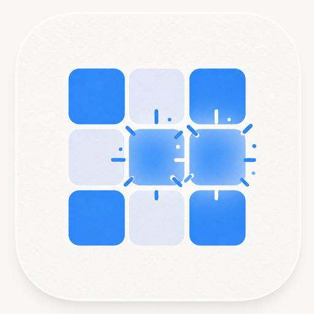

<p align="center">
  
</p>

<h1 align="center">ClearNine</h1>

<p align="center">
  <strong>A calm, original 9×9 block puzzle.</strong><br />
  Place shapes. Clear lines. Chase your best score.<br />
  <em>No ads. No timers. No accounts. No tracking.</em>
</p>

<p align="center">
  <a href="https://github.com/fefsf/clearnine/releases/latest"></a>
  
  
  
</p>

<p align="center">
  <a href="https://github.com/fefsf/clearnine/releases/latest"><strong>⬇ Download the latest APK</strong></a>
  ·
  <a href="#how-to-play"><strong>How to play</strong></a>
  ·
  <a href="#features"><strong>Features</strong></a>
</p>

---

## Why ClearNine?

ClearNine is a **zen block puzzle**: a 9×9 board divided into nine 3×3 regions, three pieces at a time, and as much thinking time as you want.

It was built to feel **retail-polished** without the usual mobile-game baggage:

| ClearNine | Typical free puzzle apps |
|---|---|
| **100% ad-free** — forever | Banner ads, interstitial ads, rewarded ads |
| No timers, no energy meters | Artificial pressure and wait timers |
| No accounts or cloud login | Forced sign-in walls |
| No tracking or analytics SDKs | Telemetry and ad IDs |
| Plays fully **offline** | Needs a network for “features” |
| Large readable UI | Tiny controls and clutter |

> **Promise:** ClearNine will not show ads, sell your data, or nag you with IAPs. Progress stays on your device.

---

## What the game is

ClearNine is an original polyomino puzzle inspired by the familiar “fill the grid, clear the lines” fantasy — **not** affiliated with any commercial title.

### The board

- A **9×9 grid**, visually split into **nine 3×3 squares** (Sudoku-style regions)
- Alternating region tint so the board is easy to read at a glance
- Uniform block color per theme (clean, calm look)

### The pieces

You always have up to **three** shapes in a tray at the bottom of the screen. The catalog includes:

- Single dots and short lines
- Trominoes and corners
- Classic tetrominoes (L, T, S/Z, squares, straights)
- Larger shapes (5-cell corners, U, plus, long 5-lines, full 3×3)

Pieces are **fixed orientation** — no rotation and no hold queue. Plan with what you have.

### The goal

Keep placing pieces and clearing space for as long as you can. Your run ends when **none** of the pieces still in the tray can fit anywhere on the board.

---

## How to play

### Basics

1. **Drag** a piece from the tray onto the board.
2. Aim with the floating piece — the green preview shows where it will land (red if it can’t fit).
3. **Clear space** by completely filling any:
   - Horizontal **row** of 9
   - Vertical **column** of 9
   - Any of the nine **3×3** regions
4. When all three tray pieces are used, you get **three new ones**.
5. Repeat until no remaining piece can fit — that’s game over.

### Placement tips

- The floating piece sits **above your finger** so you can see the board.
- Placement is **WYSIWYG**: what you see on the grid is what drops.
- Near edges and corners, ClearNine gently **snaps** to the nearest valid spot (without teleporting across the board).
- Invalid drops shake the board and refuse the move — the piece returns to the tray.

### Combos & streaks

| Term | Meaning |
|---|---|
| **Combo** | One placement clears **two or more** lines/regions at once |
| **Streak** | You clear something on **back-to-back** placements |

Bigger combos and longer streaks score more — and look flashier (sweeps, sparks, banners, haptics).

### Undo

- **Classic (Play):** up to **3** undos per game  
- **Daily:** **1** undo per game  

Undo reverses your last placement (board, tray, and score).

---

## Game modes

### Play (Classic)

Endless high-score mode. Relax, plan, and beat your personal best. Progress auto-saves so you can **Continue** later.

### Today’s Puzzle (Daily)

One special run each calendar day:

- The piece sequence is **seeded by the date** (everyone playing that day gets the same deals)
- The board starts with a couple of **starter blocks** (also date-seeded) so the puzzle is a bit harder
- Separate “best today” tracking
- Daily play contributes to streak-style awards

### Continue

Resume an unfinished Classic or Daily game without losing your board or score.

---

## Features

### Core gameplay

- Original 9×9 / 3×3 clear rules
- Wide piece catalog (1-cell through large shapes)
- Three-piece tray with auto-refill
- No rotation, no hold queue, no time limit
- Game-over when no tray piece fits
- Local save for unfinished games and best scores

### Feel & feedback

- Soft place “thock”, clear chimes, combo cascades
- Haptics on place, clear, bad drop, undo (toggleable)
- Land animation, clear sweeps, spark bursts
- Combo vignette & streak ring on the board
- Score count-up with pulse
- Confetti on a new personal best
- Splash screen + first-run tutorial

### Comfort & accessibility

- Large labeled buttons and readable type
- Responsive layout that fits short phones and display zoom
- Score bar, tray, and toolbar stay visible (board scales to free space)
- Stuck hint: after idle time, the easiest fitting piece gently glows
- Sound and vibration toggles in **Settings**
- **Check for updates** in Settings — looks up the latest GitHub release (optional; game stays offline otherwise)

### Progression (all local)

- **My Scores** — best Play score, best today, daily streak, recent games, lifetime stats
- **Awards** — trophies for scores, combos, streaks, dedication, and daily habits
- **Colors (Themes)** — unlockable looks (see below)

### Themes

| Theme | Access |
|---|---|
| **Minimalist** | Free (default) — bright board, flat blue blocks |
| **Classic Wood** | Free — warm wood-grain board & pieces |
| **Ocean** | Free |
| **Sunset** | Unlock via award *Getting started* (score 500 Classic) |
| **Forest** | Unlock via award *Triple clear* (Combo ×3) |
| **Midnight** | Unlock via award *Block master* (score 5,000 Classic) |

Every theme uses a **single uniform block color** for a clean, calm look.

### Awards (examples)

- Getting started · Sharp eye · Block master  
- Triple clear · Quad blast · On a roll  
- Century · Dedicated · Clean sweep · Regular  
- Day one · Three-day rhythm · Week warrior  

---

## Scoring

| Event | Points |
|---|---|
| Each cell placed | **+1** |
| Each cleared row / column / 3×3 | **+18** |
| Combo (2+ clears in one move) | Bonus scales with combo size |
| Streak (2+ clear-moves in a row) | **+5 × streak level** |

All scoring, saves, and awards live in **on-device storage** (`localStorage`). Nothing is uploaded.

---

## 100% ad-free

ClearNine is free of:

- Banner / interstitial / video ads  
- “Watch an ad for a hint” prompts  
- In-app purchases and energy systems  
- Account walls and newsletters  
- Third-party ad or analytics SDKs  

Just open the app and play.

---

## Download (Android)

Grab the latest signed release:

**[Releases → Latest APK](https://github.com/fefsf/clearnine/releases/latest)**

1. Download `ClearNine-vX.Y.apk` on your phone  
2. Open the file and allow installs from that source if asked  
3. Tap **Install**, then open **ClearNine**  

If Play Protect warns on a sideloaded APK, choose **Install anyway** — the build is release-signed by the project keystore, not Play Store distribution.

---

## Play in the browser (dev)

```bash
cd clearnine
npm install
npm run dev
```

Open the local URL (usually `http://localhost:5173`). Touch works great on a phone browser on the same network.

---

## Build the Android APK yourself

### Requirements

- Node.js 20+  
- **JDK 21+** (Capacitor 8)  
- Android SDK / command-line tools (Android Studio is easiest)

```powershell
$env:JAVA_HOME = "C:\Program Files\Microsoft\jdk-21.0.11-hotspot"
$env:ANDROID_HOME = "$env:LOCALAPPDATA\Android\Sdk"
```

### Scripts

| Script | Purpose |
|---|---|
| `npm run dev` | Local web play |
| `npm run build` | Production web build → `dist/` |
| `npm run cap:sync` | Build + sync into the Android project |
| `npm run apk` | Debug APK → `ClearNine.apk` |
| `npm run apk:release` | Signed release APK → `ClearNine-release.apk` |

Release signing uses `android/keystore.properties` + a local keystore (both gitignored). See [`SIGNING.md`](SIGNING.md).

```bash
npm run apk:release
```

---

## Privacy at a glance

- No accounts  
- No network requirement to play  
- No ads or trackers  
- Scores and settings stay on the device  

---

## License / branding

Original game and artwork. **Not affiliated with** any commercial block-puzzle trademark or publisher.

---

<p align="center">
  <strong>ClearNine</strong> — Simple. Calm. No ads.<br />
  <a href="https://github.com/fefsf/clearnine/releases/latest">Download the APK</a>
</p>
